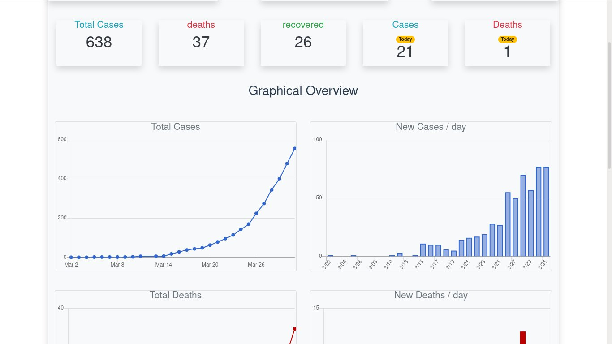

# Covid-19 Tracker (Morocco)


## Introduction

Since Everybody has build a Coronva-virus tracker during Quarantine.

I Thought about playing with some VueJs and Docker, so I made this :smiley:

check: [http://ablil.tech:1337](http://ablil.tech:1337)

## Technologies

* Vue (@vue/cli 4.2.3) : No need to explain :wink:
* Docker (Docker version 19.03.8, build afacb8b7f0) : hosting the app
* Bootstrap 4.4.1 : styling UI
* Axios (0.19.2) : making API calls
* chart.js (2.9.3): generating graphs


## Example of usage

### In docker container

Make sure Docker is installed before precedding.

```
# clone the repo
git clone https://github.com/ablil/covid19tracker.git
cd covid19tracker/

# create container and run
docker build -t covid19:dev .
docker run -d -p 1337:8080 --network host covid19:dev
```

### In localhost (Development)

```
> clone the repo
git clone https://github.com/ablil/covid19tracker.git
cd covid19tracker/

> using
npm install
npm run build

> using yarn
yarn serve

> using http-server
npm install -g http-server
http-server -p 1337 dist/
```

## Overview

